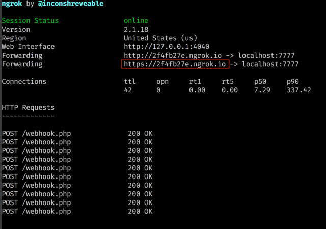
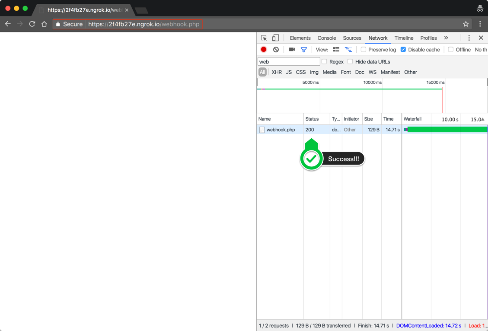
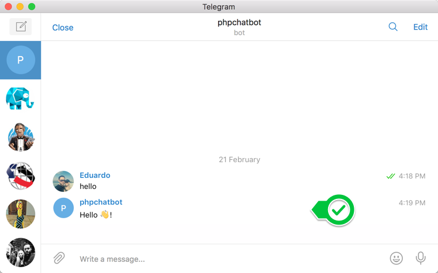

# Chatbots with PHP
Chat Bots intro for the PHP Jalisco User Group


## Getting started
1. Get `ngrok` installed (see [here](https://ngrok.com/download)). You could also use [LocalTunnel](https://localtunnel.github.io/www/).
2. Register your Bot with The [BotFather](https://telegram.me/BotFather)
    - You will need a Bot Name (like `PHPDemoBot`), Bot Handle (like `phpdemobot`)
    - You will get a `token` save that. You will use it as `$telegramToken`. It looks something like `123456:ABC-DEF1234ghIkl-zyx57W2v1u123ew11`
    
3. Run your the code with 
 ```bash
$ php -S 0.0.0.0:7777 webhook.php
```
4. Hook your ngrok with your bot
 ```bash
ngrok http 7777
```

5. Update `$tunnelURL` in the code to match the URL from ngrok.

 
 
 ```php
 $tunnelURL = 'https://2f4fb27e.ngrok.io/webhook.php';
 ```


5. Go to your ngrok endpoint so that the bot registers.

 


6. Start the chattin'

 
